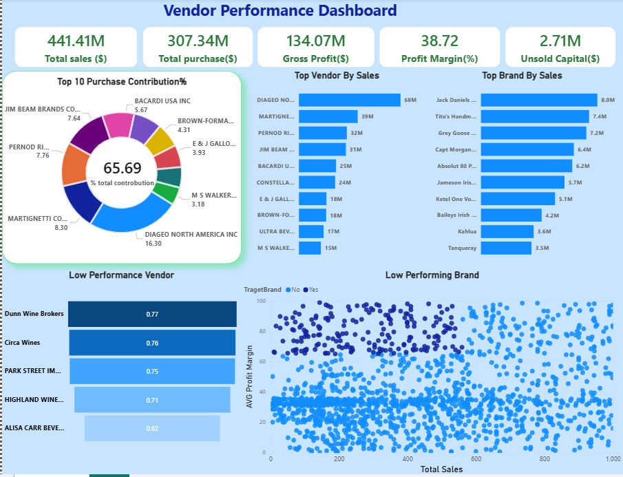
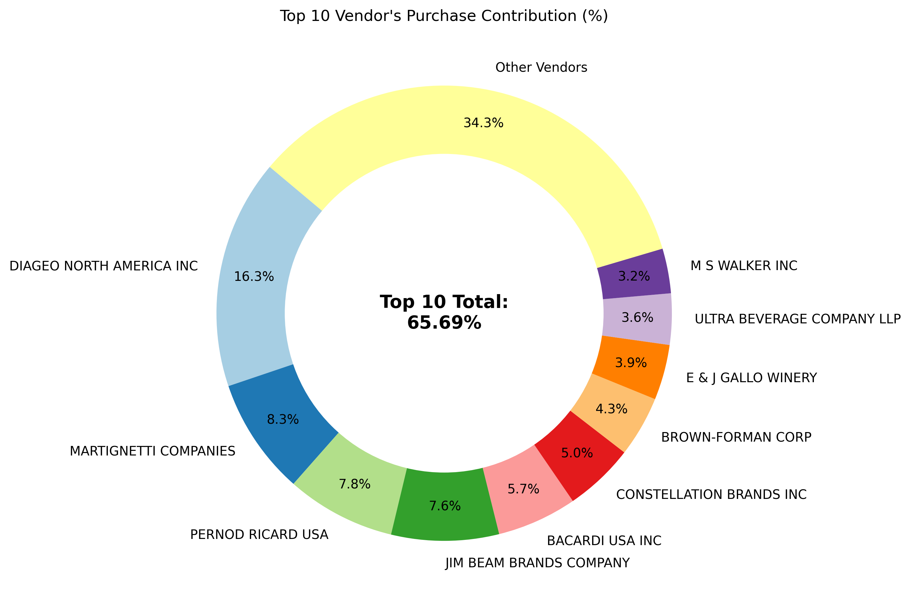
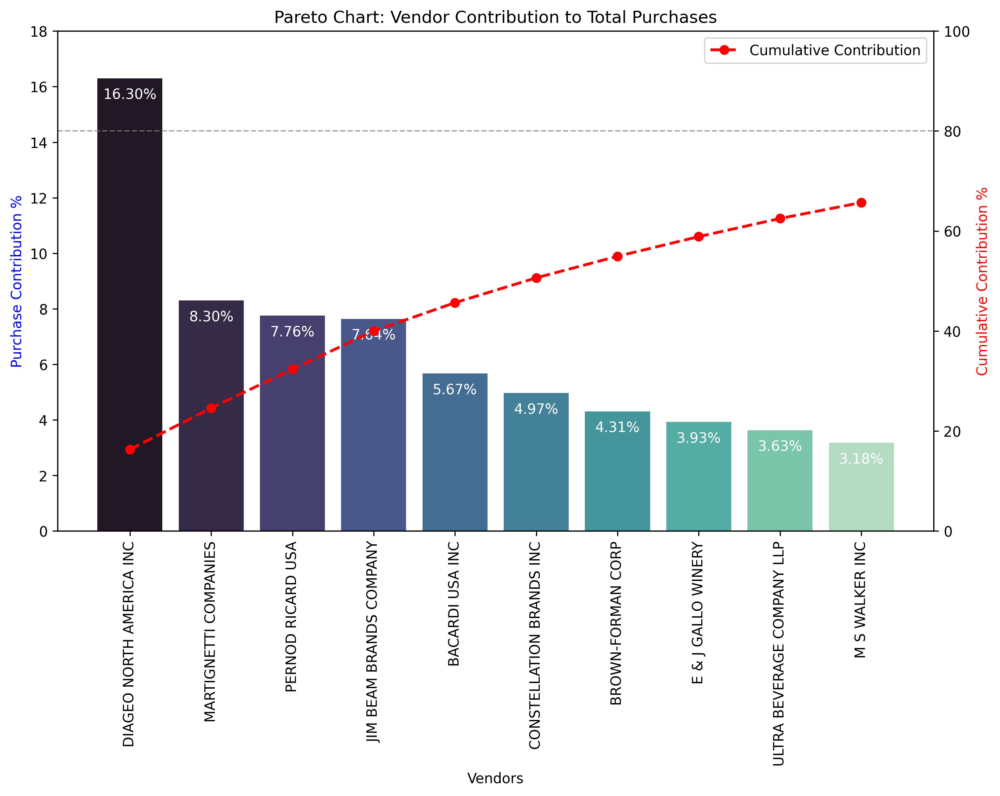
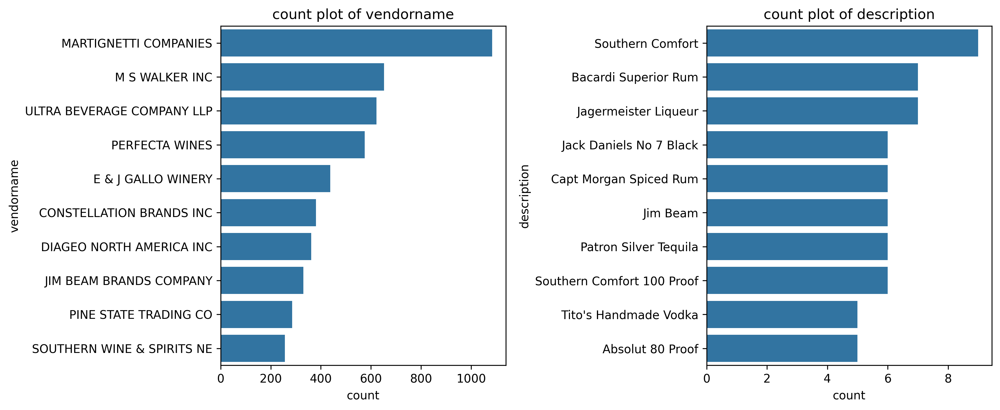
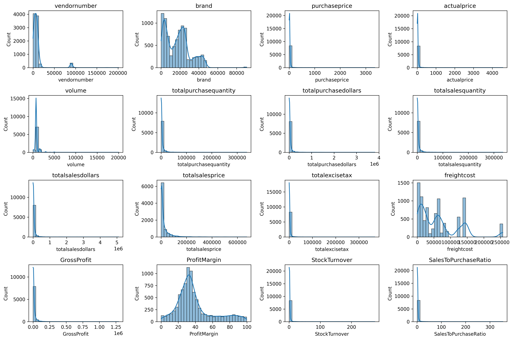
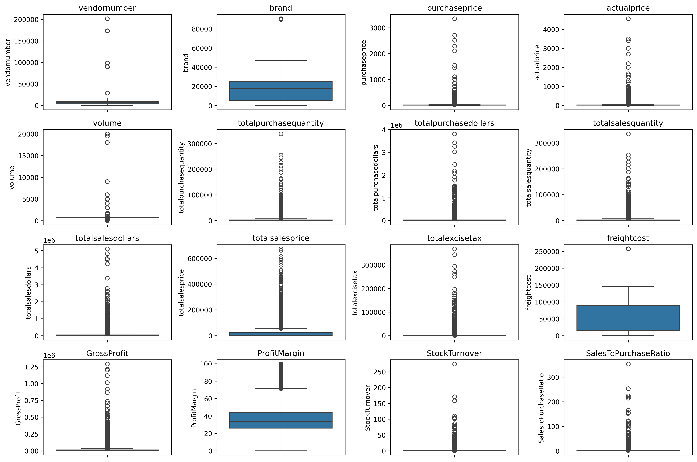
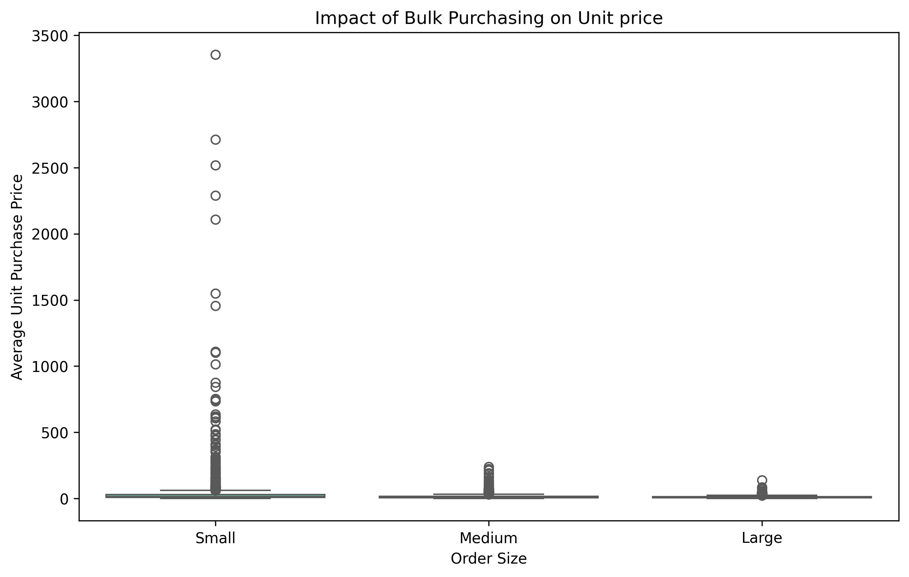
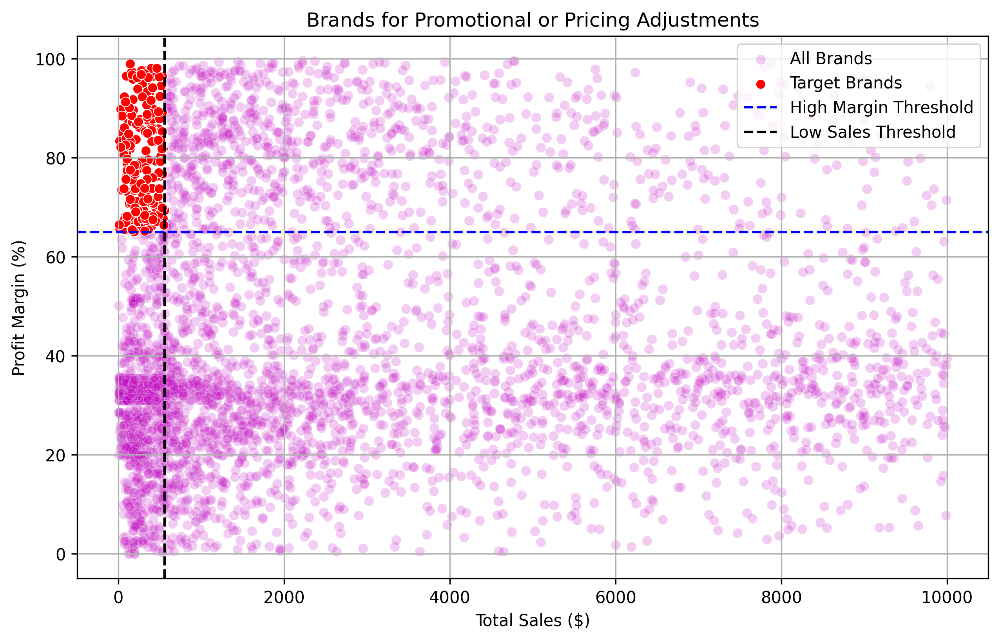
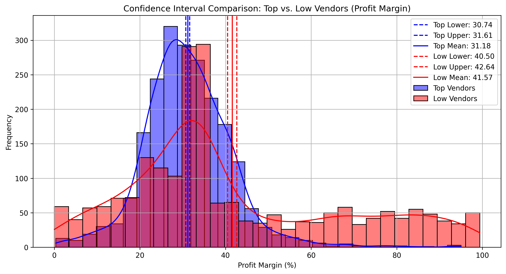
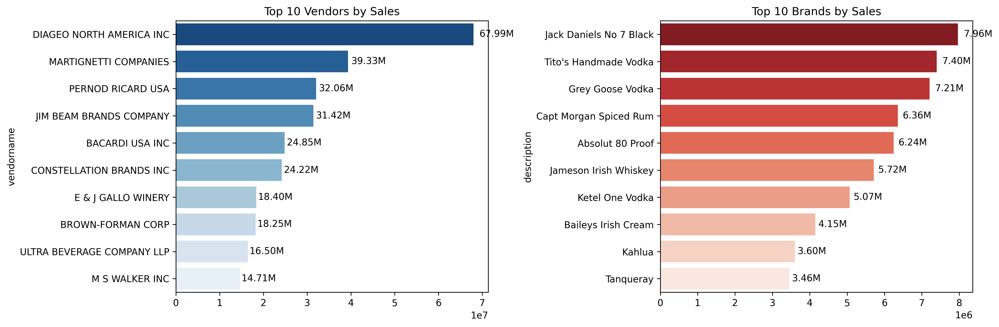

# Vendor Performance Analytics

## End-to-End Data Analytics Project using SQL, Python, Statistics & Power BI

This project presents an end-to-end vendor performance analysis using
SQL, Python, Statistical Analysis, and Power BI. It transforms raw
purchasing and sales data into actionable business insights for
procurement optimization, profitability improvement, and executive
decision-making.
## Table of Contents

- [Dashboard Preview](#dashboard-preview)
- [Project Objectives](#project-objectives)
- [Tech Stack](#tech-stack)
- [Dashboard KPIs](#dashboard-kpis)
- [Dashboard Insights](#dashboard-insights)
- [Notebook Analysis](#notebook-analysis)
  - [Purchase Contribution](#purchase-contribution)
  - [Pareto Analysis](#pareto-analysis)
  - [Top Vendors & Brands](#top-vendors--brands)
  - [Correlation Heatmap](#correlation-heatmap)
  - [Distribution Analysis](#distribution-analysis)
  - [Outlier Analysis](#outlier-analysis)
  - [Order Size Analysis](#order-size-analysis)
  - [Promotion Opportunity](#promotion-opportunity)
  - [Confidence Interval](#confidence-interval)
  - [Vendor Comparison](#vendor-comparison)
- [Statistical Techniques](#statistical-techniques)
- [Business Recommendations](#business-recommendations)
- [Power BI Dashboard Features](#power-bi-dashboard-features)
- [Project Structure](#project-structure)
- [Conclusion](#conclusion)
- [Future Improvements](#future-improvements)
- [Author](#author)


## Dashboard Preview



## Project Objectives

-   Identify top-performing vendors and brands.
-   Measure vendor purchase contribution.
-   Analyze profitability and gross profit.
-   Detect inventory inefficiencies.
-   Identify promotional opportunities.
-   Perform statistical analysis.
-   Build an interactive Power BI dashboard.

## Tech Stack

-   SQL (SQLite)
-   SQLAlchemy
-   Python
-   Pandas
-   NumPy
-   Matplotlib
-   Seaborn
-   SciPy
-   Jupyter Notebook
-   Power BI

## Dashboard KPIs

  KPI                         Value
  ---------------- ----------------
  Total Sales        441.41 Million
  Total Purchase     307.34 Million
  Gross Profit       134.07 Million
  Profit Margin              38.72%
  Unsold Capital       2.71 Million

## Dashboard Insights


-   Top 10 vendors contribute **65.69%** of total purchases.
-   DIAGEO NORTH AMERICA INC is the top revenue-generating vendor.
-   Jack Daniel's No.7 Black is the best-selling brand.
-   High sales do not always mean high profit margins.

## Notebook Analysis

### Purchase Contribution



**Insight:** Top 10 vendors contribute 65.69% of purchases, indicating
supplier concentration.

### Pareto Analysis



**Insight:** A small number of vendors generate most purchase value.

### Top Vendors & Brands



**Insight:** DIAGEO NORTH AMERICA INC leads vendors while Jack Daniel's
No.7 Black leads brands.

### Correlation Heatmap


**Insight:** Gross Profit strongly correlates with Sales, while Profit
Margin has a weaker relationship.

### Distribution Analysis



**Insight:** Most variables are positively skewed with long-tail
distributions.

### Outlier Analysis



**Insight:** Outliers represent genuine high-value business
transactions.

### Order Size Analysis



**Insight:** Larger orders generally achieve lower purchase prices.

### Promotion Opportunity



**Insight:** High-margin, low-sales brands are ideal promotion targets.

### Confidence Interval



**Insight:** Statistical testing confirms significant differences in
profit margins between top and low-performing vendors.

### Vendor Comparison



**Insight:** Top vendors rely on sales volume while low-performing
vendors rely on higher margins.

## Statistical Techniques

-   Correlation Analysis
-   Distribution Analysis
-   Outlier Detection
-   Pareto Analysis
-   Confidence Interval Estimation
-   Two-Sample T-Test

## Business Recommendations

-   Diversify procurement.
-   Promote high-margin low-sales brands.
-   Increase bulk purchasing.
-   Improve inventory planning.
-   Optimize freight costs.
-   Use statistical insights for pricing decisions.

## Power BI Dashboard Features

-   KPI Cards
-   Vendor & Brand Analysis
-   Purchase Contribution
-   Scatter Plot
-   Interactive Filters
-   Drill-down Analysis

## Project Structure

``` text
Vendor-Performance-Analytics
├── notebook_images
├── notebooks
├── Power_BI
├── Python_Scripts
├── SQL
├── Vendor_Data
├── README.md
├── requirements.txt
└── .gitignore
```

## Conclusion

This project demonstrates an end-to-end analytics workflow using SQL,
Python, Statistics, and Power BI. The analysis shows that a small number
of vendors contribute most purchases, while several high-margin brands
remain underutilized. Statistical analysis validates the observed
profitability differences, enabling data-driven procurement, pricing,
and inventory decisions. The Power BI dashboard provides an interactive
view for monitoring vendor performance and supporting business strategy.

## Future Improvements

-   Machine Learning forecasting
-   Automated ETL
-   Live SQL connectivity
-   Scheduled Power BI refresh
-   Predictive vendor scoring

## Author

**Shubham Verma**

GitHub: https://github.com/shubham-verma-0

Project: https://github.com/shubham-verma-0/Vendor-Performance-Analytics

LinkedIn: https://www.linkedin.com/in/shubham-verma-872838140/
